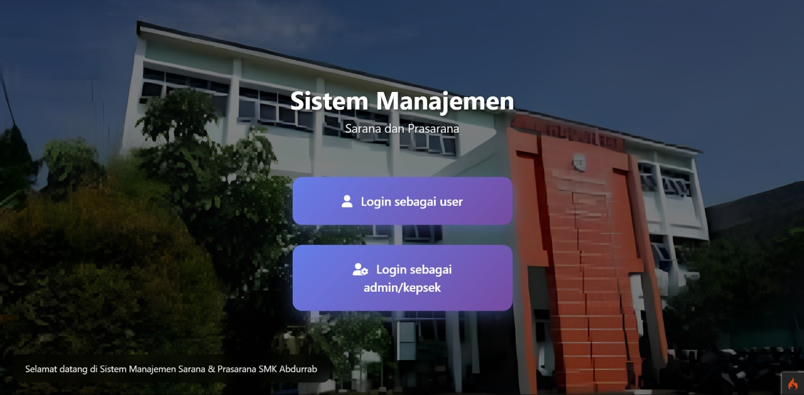
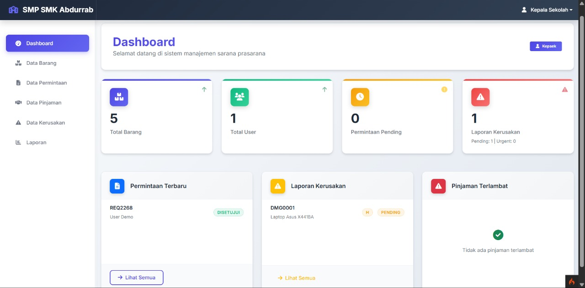
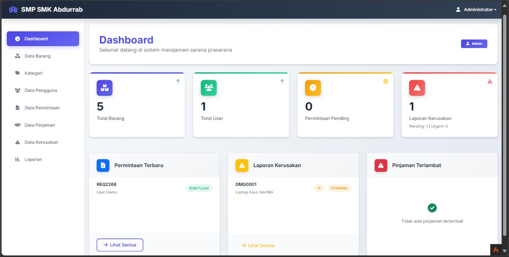
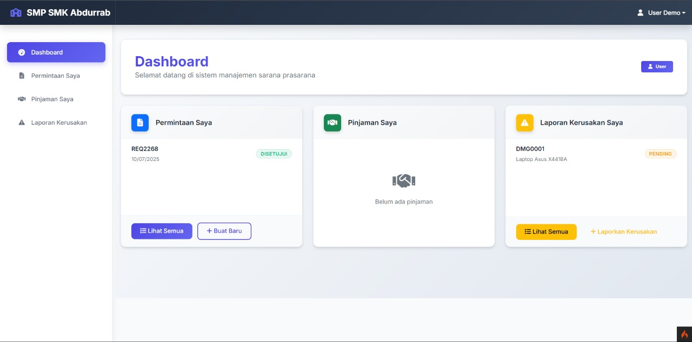

# Sistem Manajemen Sarana Prasarana SMK Abdurrab Pekanbaru

Sistem informasi berbasis web untuk mengelola sarana dan prasarana di SMK Abdurrab Pekanbaru. Memudahkan proses peminjaman barang, pelaporan kerusakan, dan manajemen inventaris sekolah.

## 📋 Daftar Isi

- [Tentang Project](#tentang-project)
- [Fitur](#fitur)
- [Teknologi](#teknologi)
- [Instalasi](#instalasi)
- [Cara Penggunaan](#cara-penggunaan)
- [Screenshot](#screenshot)
- [Role & Akses](#role--akses)
- [Struktur Database](#struktur-database)
- [Kontribusi](#kontribusi)
- [Lisensi](#lisensi)
- [Kontak](#kontak)

## 🎯 Tentang Project

Sistem Manajemen Sarana Prasarana SMK Abdurrab Pekanbaru adalah aplikasi web yang dirancang untuk:
- Mengelola inventaris sarana dan prasarana sekolah
- Memfasilitasi proses peminjaman barang oleh siswa dan guru
- Monitoring dan pelaporan kerusakan barang
- Menyediakan dashboard analitik untuk kepala sekolah dan administrator

Project ini dikembangkan untuk meningkatkan efisiensi pengelolaan aset sekolah dan memberikan transparansi dalam proses peminjaman barang.

## ✨ Fitur

### 👤 Fitur User (Siswa/Guru)
- [x] Login dan autentikasi
- [x] Melihat daftar barang tersedia
- [x] Mengajukan peminjaman barang
- [x] Melihat status peminjaman
- [x] Melaporkan kerusakan barang
- [x] Riwayat peminjaman pribadi

### 👨‍💼 Fitur Kepala Sekolah
- [x] Dashboard overview sarana prasarana
- [x] Laporan statistik peminjaman
- [x] Laporan kerusakan barang
- [x] Monitoring aktivitas sistem
- [x] Approve/reject peminjaman khusus

### 🔧 Fitur Administrator
- [x] Manajemen data barang
- [x] Manajemen kategori barang
- [x] Manajemen pengguna (CRUD)
- [x] Approve/reject peminjaman
- [x] Manajemen laporan kerusakan
- [x] Backup dan restore data
- [x] Laporan lengkap sistem

## 🛠️ Teknologi

**Backend:**
- PHP 8.0+
- CodeIgniter 4
- MySQL 8.0+

**Frontend:**
- HTML5
- CSS3
- JavaScript ES6+
- Bootstrap 5
- Chart.js (untuk dashboard)

**Tools:**
- Composer
- Git
- XAMPP/LAMP

## 🚀 Instalasi

### Prasyarat
```bash
# Pastikan PHP dan Composer terinstall
php --version
composer --version

# MySQL/MariaDB
mysql --version
```

### Langkah Instalasi

1. **Clone repository**
```bash
git clone https://github.com/fixxyinhere/smp_smk_abdurrab.git
cd smp_smk_abdurrab
```

2. **Install dependencies**
```bash
composer install
```

3. **Setup database**
```bash
# Buat database MySQL
mysql -u root -p
CREATE DATABASE smp_smk_abdurrab;
exit
```

4. **Konfigurasi environment**
```bash
# Copy file environment
cp env .env

# Edit file .env dan sesuaikan:
# database.default.hostname = localhost
# database.default.database = smp_smk_abdurrab
# database.default.username = root
# database.default.password = 
```

5. **Migrate database**
```bash
php spark migrate
php spark db:seed DatabaseSeeder
```

6. **Jalankan aplikasi**
```bash
php spark serve
```

Akses aplikasi di: `http://localhost:8080`

## 📖 Cara Penggunaan

### Login Default
- **Administrator**: admin@smkabdurrab.id | password: admin123
- **Kepala Sekolah**: kepsek@smkabdurrab.id | password: kepsek123  
- **User Demo**: demo@smkabdurrab.id | password: demo123

### Alur Peminjaman Barang
1. User login ke sistem
2. Pilih barang yang ingin dipinjam
3. Isi form peminjaman (tanggal, keperluan, dll)
4. Submit permintaan peminjaman
5. Admin approve/reject peminjaman
6. Barang siap dipinjam (jika disetujui)

### Pelaporan Kerusakan
1. User menemukan barang rusak
2. Buat laporan kerusakan dengan detail
3. Admin memverifikasi laporan
4. Tindakan perbaikan/penggantian barang

## 📸 Screenshot

### Halaman Login

*Halaman login dengan pilihan role user dan admin/kepsek*

### Dashboard Kepala Sekolah

*Dashboard overview dengan statistik total barang, user, dan laporan*

### Dashboard Administrator

*Dashboard admin dengan akses penuh ke semua fitur manajemen*

### Dashboard User

*Dashboard user dengan akses peminjaman dan pelaporan*

## 👥 Role & Akses

| Fitur | User | Kepsek | Admin |
|-------|------|--------|-------|
| Login | ✅ | ✅ | ✅ |
| Lihat Barang | ✅ | ✅ | ✅ |
| Pinjam Barang | ✅ | ✅ | ✅ |
| Lapor Kerusakan | ✅ | ✅ | ✅ |
| Dashboard Statistik | ❌ | ✅ | ✅ |
| Manajemen Barang | ❌ | ❌ | ✅ |
| Manajemen User | ❌ | ❌ | ✅ |
| Approve Peminjaman | ❌ | ✅ | ✅ |

## 🗄️ Struktur Database

**Tabel Utama:**
- `users` - Data pengguna sistem
- `barang` - Data inventaris barang
- `kategori` - Kategori barang
- `peminjaman` - Transaksi peminjaman
- `laporan_kerusakan` - Laporan kerusakan barang
- `data_pinjaman` - Detail peminjaman barang

## 🤝 Kontribusi

Kontribusi sangat diterima! Silakan ikuti langkah berikut:

1. Fork project ini
2. Buat branch fitur (`git checkout -b feature/NewFeature`)
3. Commit perubahan (`git commit -m 'Add: New feature'`)
4. Push ke branch (`git push origin feature/NewFeature`)
5. Buat Pull Request

### Coding Standards
- Gunakan PSR-4 untuk autoloading
- Ikuti CodeIgniter 4 best practices
- Tambahkan komentar pada kode kompleks
- Test fitur sebelum submit PR

## 📝 Lisensi

Project ini menggunakan lisensi [MIT](LICENSE).

## 📧 Kontak

**Developer**: fixxyinhere  
**Email**: [your-email@example.com](mailto:your-email@example.com)  
**GitHub**: [@fixxyinhere](https://github.com/fixxyinhere)

**Project Links:**
- **Repository**: [https://github.com/fixxyinhere/smp_smk_abdurrab](https://github.com/fixxyinhere/smp_smk_abdurrab)
- **Issues**: [https://github.com/fixxyinhere/smp_smk_abdurrab/issues](https://github.com/fixxyinhere/smp_smk_abdurrab/issues)

---

🏫 **SMK Abdurrab Pekanbaru** - Sistem Manajemen Sarana Prasarana  
⭐ Jangan lupa kasih star kalau project ini membantu!